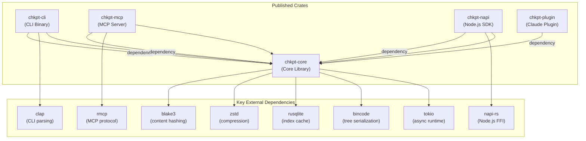
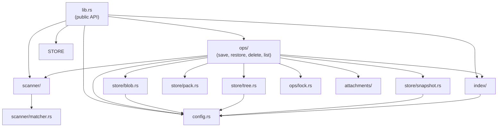
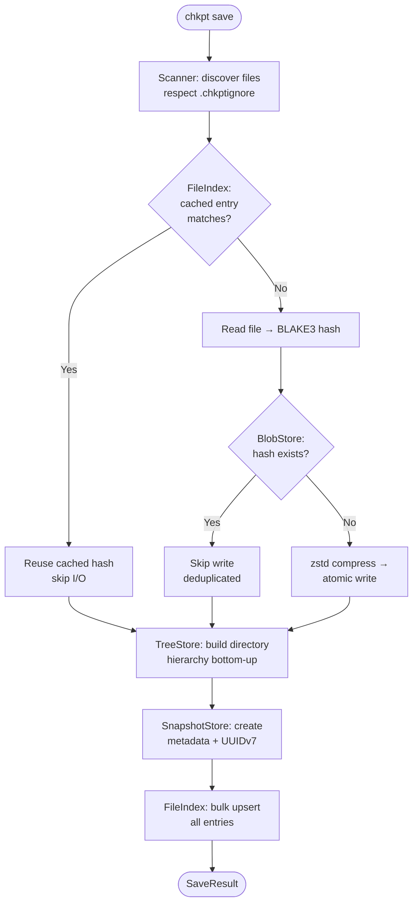
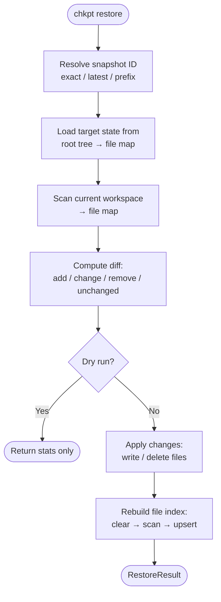
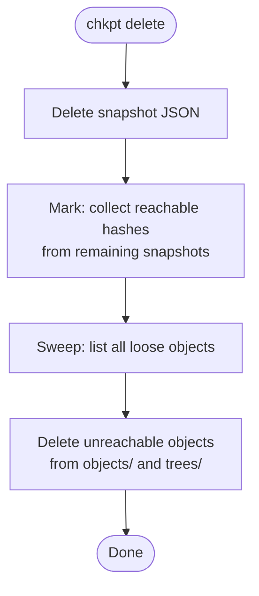

# chkpt Architecture Documentation

> **chkpt** — A fast, content-addressable checkpoint system for saving and restoring workspace snapshots without touching Git.

This document provides a comprehensive architectural overview of chkpt, including monorepo structure, crate dependencies, internal module organization, design patterns, and data flows.

---

## Table of Contents

1. [System Overview](#system-overview)
2. [Monorepo Structure](#monorepo-structure)
3. [Crate Dependency Graph](#crate-dependency-graph)
4. [Core Library Architecture](#core-library-architecture)
5. [Scanner Module](#scanner-module)
6. [Store Modules](#store-modules)
7. [Index Module](#index-module)
8. [Operations Module](#operations-module)
9. [Attachments Module](#attachments-module)
10. [Configuration & Guardrails](#configuration--guardrails)
11. [Error Handling](#error-handling)
12. [User Interface Layers](#user-interface-layers)
13. [Storage Layout](#storage-layout)
14. [Data Flow Diagrams](#data-flow-diagrams)
15. [Testing Infrastructure](#testing-infrastructure)

---

## System Overview

### High-Level Architecture

```
┌────────────────────────────────────────────────────────────────────────┐
│              chkpt — Content-Addressable Checkpoint System              │
└────────────────────────────────────────────────────────────────────────┘

User Input          Interface Layer       Core Library          Storage
──────────          ───────────────       ────────────          ───────

$ chkpt save    ─→  CLI              ─→  Scanner           ─→  ~/.chkpt/
$ chkpt restore     (clap)               (file discovery)      stores/
                    MCP Server            BlobStore             <project>/
                    (rmcp, stdio)         (BLAKE3 + zstd)       ├─ objects/
                    Node.js SDK           TreeStore             ├─ trees/
                    (NAPI bindings)       (bincode)             ├─ snapshots/
                    Claude Plugin         SnapshotStore         ├─ packs/
                    (MCP + skill)         (JSON metadata)       └─ index.sqlite
                                               ↓
                                          On failure:
                                          File-based locking
                                          prevents corruption
```

### Key Components

| Component | Crate | Responsibility |
|-----------|-------|----------------|
| **Core Library** | `chkpt-core` | Scanner, store, index, operations, attachments |
| **CLI** | `chkpt-cli` | Clap-based CLI with interactive restore selection |
| **MCP Server** | `chkpt-mcp` | Model Context Protocol server (stdio transport) |
| **Node.js SDK** | `chkpt-napi` | Native Node.js bindings via NAPI |
| **Claude Plugin** | `chkpt-plugin` | MCP tools + automation skill for Claude Code |

### Design Principles

1. **Content-Addressable Storage**: BLAKE3 hashing ensures identical content is stored once across all snapshots
2. **Git-Independent**: Snapshots live outside `.git/` — no commits, no branches, no merge conflicts
3. **Incremental by Default**: SQLite index caches file metadata to skip re-hashing unchanged files
4. **Atomic Operations**: File-based locking prevents concurrent corruption; temp-file-then-rename for writes
5. **Multi-Interface**: Core library is interface-agnostic — CLI, MCP, NAPI, and Plugin all share the same ops

---

## Monorepo Structure

```
chkpt/
├── crates/
│   ├── chkpt-core/                       Core library (all business logic)
│   │   ├── src/
│   │   │   ├── lib.rs                    Public API
│   │   │   ├── config.rs                 Store layout & guardrails
│   │   │   ├── error.rs                  Error types (thiserror)
│   │   │   ├── scanner/                  File discovery & filtering
│   │   │   │   ├── mod.rs                Scanner entry point
│   │   │   │   ├── walker.rs             Recursive directory traversal
│   │   │   │   └── matcher.rs            Ignore pattern matching
│   │   │   ├── store/                    Content-addressed object store
│   │   │   │   ├── blob.rs               File content storage (BLAKE3 + zstd)
│   │   │   │   ├── tree.rs               Directory structure storage (bincode)
│   │   │   │   ├── pack.rs               Packed object bundles (optimization)
│   │   │   │   └── snapshot.rs           Snapshot metadata (JSON)
│   │   │   ├── index/                    SQLite file metadata cache
│   │   │   │   ├── mod.rs                FileIndex operations
│   │   │   │   └── schema.rs             Table definitions & migrations
│   │   │   ├── ops/                      Checkpoint operations
│   │   │   │   ├── mod.rs                Operation exports
│   │   │   │   ├── save.rs               Save workspace → snapshot
│   │   │   │   ├── restore.rs            Restore snapshot → workspace
│   │   │   │   ├── delete.rs             Delete snapshot + GC
│   │   │   │   ├── list.rs               List snapshots
│   │   │   │   └── lock.rs               File-based mutual exclusion
│   │   │   └── attachments/              Optional dependency & git capture
│   │   │       ├── mod.rs                Attachment exports
│   │   │       ├── deps.rs               node_modules archive (tar.zst)
│   │   │       └── git.rs                Git bundle creation/restore
│   │   └── tests/                        Integration & unit tests
│   │       ├── blob_test.rs
│   │       ├── tree_test.rs
│   │       ├── snapshot_test.rs
│   │       ├── index_test.rs
│   │       ├── scanner_test.rs
│   │       ├── save_test.rs
│   │       ├── restore_test.rs
│   │       ├── delete_test.rs
│   │       ├── list_test.rs
│   │       ├── pack_test.rs
│   │       ├── lock_test.rs
│   │       ├── deps_test.rs
│   │       ├── git_attachment_test.rs
│   │       ├── config_test.rs
│   │       └── e2e_test.rs
│   │
│   ├── chkpt-cli/                        CLI binary
│   │   └── src/
│   │       └── main.rs                   Clap commands + interactive UI
│   │
│   ├── chkpt-mcp/                        MCP server
│   │   └── src/
│   │       └── main.rs                   stdio transport, 4 tools
│   │
│   ├── chkpt-napi/                       Node.js native bindings
│   │   ├── src/
│   │   │   ├── lib.rs                    Module registration
│   │   │   ├── ops.rs                    save/list/restore/delete
│   │   │   ├── scanner.rs                scan_workspace binding
│   │   │   ├── store.rs                  Snapshot/blob access
│   │   │   ├── index.rs                  File index access
│   │   │   ├── config.rs                 Store layout binding
│   │   │   └── attachments.rs            Deps/git binding
│   │   └── __test__/                     Vitest tests
│   │
│   └── chkpt-plugin/                     Claude Code plugin
│       └── ...                           MCP tools + /chkpt skill
│
├── Cargo.toml                            Workspace root
├── README.md
└── CONTRIBUTING.md
```

### Workspace Configuration

- **Build System**: Cargo workspaces (root `Cargo.toml`)
- **Members**: `crates/chkpt-core`, `crates/chkpt-cli`, `crates/chkpt-mcp`, `crates/chkpt-napi`, `crates/chkpt-plugin`

---

## Crate Dependency Graph



### Dependency Direction

| From | To | Reason |
|------|----|--------|
| `chkpt-cli` → `chkpt-core` | CLI wraps core save/restore/delete/list |
| `chkpt-mcp` → `chkpt-core` | MCP server exposes core ops as tools |
| `chkpt-napi` → `chkpt-core` | NAPI bindings call core ops from Node.js |
| `chkpt-plugin` → `chkpt-core` | Plugin provides core ops to Claude Code |

---

## Core Library Architecture

### Module Organization

```
crates/chkpt-core/src/
│
├── lib.rs                   Public API
├── config.rs                StoreLayout + Guardrails + ProjectConfig
├── error.rs                 ChkptError enum (thiserror)
│
├── scanner/                 File Discovery
│   ├── mod.rs               scan_workspace() entry point
│   ├── walker.rs            Recursive directory traversal
│   └── matcher.rs           IgnoreMatcher (built-in + .chkptignore)
│
├── store/                   Content-Addressed Storage
│   ├── blob.rs              BlobStore (BLAKE3 → zstd → objects/)
│   ├── tree.rs              TreeStore (bincode → trees/)
│   ├── pack.rs              PackStore (bundled objects + indexed lookup)
│   └── snapshot.rs          SnapshotStore (JSON metadata → snapshots/)
│
├── index/                   Incremental Cache
│   ├── mod.rs               FileIndex (SQLite WAL)
│   └── schema.rs            Table definitions
│
├── ops/                     Checkpoint Operations
│   ├── mod.rs               Op exports
│   ├── save.rs              Save workflow (scan → hash → tree → snapshot)
│   ├── restore.rs           Restore workflow (diff → apply → cleanup)
│   ├── delete.rs            Delete + mark-and-sweep GC
│   ├── list.rs              List snapshots (sorted, limited)
│   └── lock.rs              ProjectLock (flock-based exclusion)
│
└── attachments/             Optional Extras
    ├── mod.rs               Attachment exports
    ├── deps.rs              Dependency archiving (tar.zst)
    └── git.rs               Git bundle creation/restore
```

### Module Dependency Flow



---

## Scanner Module

The Scanner module recursively discovers files in a workspace while respecting ignore rules.

### Key Types

```rust
pub struct ScannedFile {
    relative_path: String,      // "src/main.rs"
    absolute_path: PathBuf,     // Full filesystem path
    size: u64,                  // File size in bytes
    mtime_secs: i64,            // Unix modification timestamp
    mtime_nanos: i64,           // Nanosecond precision
    inode: Option<u64>,         // Unix inode (change detection)
    mode: u32,                  // Unix file permissions
}
```

### Ignore Rules

```
IgnoreMatcher
├── Built-in Exclusions (hardcoded, always active)
│   ├── .git/              Version control
│   ├── node_modules/      JS dependencies
│   ├── .chkpt/            Checkpoint store itself
│   └── target/            Rust build artifacts
│
└── Custom Exclusions (.chkptignore file)
    └── Uses gitignore syntax via `ignore` crate
```

### Scanning Flow

```
scan_workspace(workspace_root)
  1. Load .chkptignore (if exists)
  2. Recursively traverse from workspace root
     ├── Skip excluded directories entirely (performance)
     ├── Check each file against combined ignore rules
     ├── Skip symlinks
     └── Collect metadata (size, mtime, inode, mode)
  3. Sort results by relative path (deterministic)
  4. Return Vec<ScannedFile>
```

---

## Store Modules

The Store layer implements a content-addressed object store inspired by Git's internal design.

### BlobStore — File Content

```
objects/XX/XXXX...XXXX
        └─ 2-char prefix sharding for filesystem performance
```

```
┌──────────────────────────────────────────────────────────────────────┐
│                        BlobStore Pipeline                             │
└──────────────────────────────────────────────────────────────────────┘

Write:  file bytes ─→ BLAKE3 hash ─→ exists? ─→ No ─→ zstd compress
                                       │                    │
                                       ↓ Yes                ↓
                                     skip              temp file ─→ rename
                                                       (atomic write)

Read:   hash ─→ locate object ─→ zstd decompress ─→ file bytes
```

| Operation | Description |
|-----------|-------------|
| `write(&[u8])` | Hash → check dedup → compress → atomic write → return hash |
| `read(&str)` | Locate by hash → decompress → return bytes |
| `exists(&str)` | Check if object file exists |
| `list_loose()` | Enumerate all stored hashes |
| `remove(&str)` | Delete loose object (used by GC) |

### TreeStore — Directory Structure

Each directory is encoded as a sorted list of `TreeEntry` values, serialized with bincode, and stored content-addressed by BLAKE3 hash.

```rust
pub struct TreeEntry {
    name: String,           // Filename or directory name
    entry_type: EntryType,  // File | Dir | Symlink
    hash: [u8; 32],         // BLAKE3 hash (blob hash or subtree hash)
    size: u64,              // File size (0 for directories)
    mode: u32,              // Unix permissions
}

pub enum EntryType {
    File,       // hash points to blob
    Dir,        // hash points to another tree
    Symlink,    // target stored as blob
}
```

**Tree Construction (bottom-up):**

```
workspace/
├── src/
│   ├── main.rs          ─→ TreeEntry { name: "main.rs", type: File, hash: <blob> }
│   └── lib.rs           ─→ TreeEntry { name: "lib.rs",  type: File, hash: <blob> }
├── Cargo.toml           ─→ TreeEntry { name: "Cargo.toml", type: File, hash: <blob> }

Step 1: Build tree for src/ → hash(bincode([main.rs, lib.rs])) = <tree_src>
Step 2: Build root tree    → hash(bincode([Cargo.toml, src/])) = <root_tree>
                                                  ↑
                                    TreeEntry { name: "src", type: Dir, hash: <tree_src> }
```

### PackStore — Bundled Objects (Optimization)

Optional layer that bundles multiple loose objects into indexed pack files.

```
Pack Format:
┌──────────┬─────────┬───────┬────────────────────────────────────────┐
│ CHKP     │ VERSION │ COUNT │ [hash(32B) | comp_size(8B) | data]*   │
│ (magic)  │ (u32)   │ (u64) │                                        │
└──────────┴─────────┴───────┴────────────────────────────────────────┘

Index Format (.idx):
┌────────────────────────────────────────────────────────┐
│ [hash(32B) | offset(u64) | size(u64)]* (sorted by hash)│
└────────────────────────────────────────────────────────┘
→ Binary search for O(log n) lookup
```

### SnapshotStore — Checkpoint Metadata

```rust
pub struct Snapshot {
    id: String,                          // UUIDv7 (time-ordered)
    created_at: DateTime<Utc>,           // RFC3339 timestamp
    message: Option<String>,             // User annotation
    root_tree_hash: [u8; 32],            // Points to root tree
    parent_snapshot_id: Option<String>,   // Chain visualization
    attachments: SnapshotAttachments,     // Optional deps/git
    stats: SnapshotStats,                // File count, byte count, new objects
}

pub struct SnapshotStats {
    total_files: u64,
    total_bytes: u64,
    new_objects: u64,       // Objects not deduplicated
}

pub struct SnapshotAttachments {
    deps_key: Option<String>,   // Key for node_modules archive
    git_key: Option<String>,    // Key for git bundle
}
```

Snapshots are stored as JSON files in `snapshots/` — human-readable, no database needed.

---

## Index Module

SQLite database that caches file metadata for incremental saves, avoiding re-hashing unchanged files.

### Schema

```sql
CREATE TABLE file_index (
    path TEXT PRIMARY KEY,           -- Relative path
    blob_hash BLOB NOT NULL,         -- [u8; 32] BLAKE3 hash
    size INTEGER NOT NULL,           -- File size
    mtime_secs INTEGER NOT NULL,     -- Modification timestamp (seconds)
    mtime_nanos INTEGER NOT NULL,    -- Nanosecond component
    inode INTEGER,                   -- Unix inode (change detection)
    mode INTEGER NOT NULL            -- Unix permissions
);

CREATE TABLE metadata (
    key TEXT PRIMARY KEY,
    value TEXT NOT NULL
);
```

### Change Detection Logic

```
For each scanned file:
  1. Lookup cached entry by path
  2. Compare: mtime_secs + mtime_nanos + size + inode
     ├── All match → use cached hash (skip read + hash)
     └── Any differ → read file → BLAKE3 hash → store if new
```

This gives **O(1) per unchanged file** — no disk I/O for re-hashing. SQLite WAL mode enables concurrent readers.

### Operations

| Operation | Description |
|-----------|-------------|
| `upsert(entry)` | Insert or update single file entry |
| `bulk_upsert(entries)` | Transaction for many entries (used after save) |
| `get(path)` | Lookup by relative path |
| `remove(path)` | Delete entry |
| `all_entries()` | Full index contents |
| `all_paths()` | Path list only |
| `clear()` | Wipe entire index (used during restore) |

---

## Operations Module

Orchestrates high-level checkpoint workflows: save, restore, delete, list.

### Lock Module

Mutual exclusion using file-based locking (kernel-level flock via `fs4` crate).

```rust
pub struct ProjectLock {
    _file: File,    // Holds exclusive flock; auto-releases on drop
}
```

- Creates `locks/project.lock` file
- Returns `LockHeld` error if already locked
- No daemon required — lock auto-releases on process exit/crash

### Save Operation

**Entry point:** `save(workspace_root, SaveOptions) -> Result<SaveResult>`

```
save(workspace_root, options)
  │
  1. Compute project ID = BLAKE3(workspace_root_path)[0..16]
  2. Create store layout: ~/.chkpt/stores/<project-id>/
  3. Acquire project lock
  │
  4. Scan workspace → Vec<ScannedFile>
  5. Open SQLite file index
  6. Initialize BlobStore
  │
  7. For each scanned file:
  │  ├── Check index cache (mtime + size + inode)
  │  │   ├── Match → reuse cached hash (no I/O)
  │  │   └── Differ → read file → BLAKE3 hash
  │  ├── Check blob dedup (exists?)
  │  │   ├── Exists → skip write
  │  │   └── New → zstd compress → atomic write
  │  └── Track new_objects count
  │
  8. Build tree structure (bottom-up):
  │  ├── Group files by parent directory
  │  ├── For each directory (deepest first):
  │  │   ├── Create TreeEntry per file (hash = blob hash)
  │  │   ├── Create TreeEntry per subdir (hash = subtree hash)
  │  │   └── Serialize → BLAKE3 hash → store tree
  │  └── Root tree hash = top-level tree
  │
  9. Create Snapshot:
  │  ├── Generate UUIDv7 ID
  │  ├── Record timestamp, message, parent_snapshot_id
  │  ├── Store root_tree_hash + stats
  │  └── Write snapshot JSON
  │
  10. Bulk upsert file index
  11. Lock drops (auto-release)
  │
  └── Return SaveResult { snapshot_id, stats }
```

### Restore Operation

**Entry point:** `restore(workspace_root, snapshot_id, RestoreOptions) -> Result<RestoreResult>`

```
restore(workspace_root, snapshot_id, options)
  │
  1. Acquire project lock
  │
  2. Resolve snapshot ID:
  │  ├── "latest" → fetch most recent
  │  ├── Exact match → load directly
  │  ├── Prefix match → find unique match
  │  └── Error if ambiguous or not found
  │
  3. Load target state:
  │  └── Recursively traverse root_tree_hash
  │      → Map<path, blob_hash>
  │
  4. Scan current workspace:
  │  └── Hash each file
  │      → Map<path, current_hash>
  │
  5. Compute diff:
  │  ├── files_to_add    = target - current
  │  ├── files_to_remove = current - target
  │  ├── files_to_change = both, but hash differs
  │  └── files_unchanged = both, same hash
  │
  6. If dry_run → return stats without modifying
  │
  7. Apply changes:
  │  ├── Add/Change: read blob → create dirs → write file
  │  ├── Remove: delete file
  │  └── Cleanup empty directories
  │
  8. Rebuild file index:
  │  ├── Clear all entries
  │  ├── Re-scan workspace
  │  └── Bulk upsert new entries
  │
  └── Return RestoreResult { snapshot_id, added, changed, removed, unchanged }
```

### Delete Operation + Garbage Collection

**Entry point:** `delete(workspace_root, snapshot_id) -> Result<()>`

```
delete(workspace_root, snapshot_id)
  │
  1. Acquire project lock
  2. Verify snapshot exists
  3. Delete snapshot JSON
  │
  4. Mark-and-sweep GC:
  │  ├── Mark: iterate remaining snapshots
  │  │   └── Recursively collect reachable blob + tree hashes
  │  ├── Sweep: list all loose objects in objects/ and trees/
  │  │   └── Delete objects not in reachable set
  │  └── Note: packs are immutable, not GC'd
  │
  └── Lock drops
```

### List Operation

**Entry point:** `list(workspace_root, limit) -> Result<Vec<Snapshot>>`

Returns all snapshots sorted by creation time (newest first), with optional limit.

---

## Attachments Module

Optional feature to capture dependencies and git history alongside file snapshots.

### Dependencies (deps.rs)

Captures `node_modules` or other dependency directories as compressed archives.

```
compute_deps_key(lockfile_path) → String
  └── BLAKE3(lockfile_content)[0..16]     ← deterministic, deduplicates by lockfile

archive_deps(deps_dir, archive_dir, deps_key) → String
  └── tar(deps_dir) → zstd compress → <deps_key>.tar.zst
      (skip if key already exists → dedup)

restore_deps(deps_dir, archive_dir, deps_key)
  └── Read <deps_key>.tar.zst → decompress → extract to deps_dir
```

### Git History (git.rs)

Captures git repository state as a bundle.

```
create_git_bundle(repo_path, archive_dir) → String
  ├── git bundle create --all <temp_file>
  ├── git_key = BLAKE3(bundle)[0..16]
  └── Move to <git_key>.bundle

restore_git_bundle(repo_path, archive_dir, git_key)
  ├── git bundle list-heads → discover branches
  ├── Fetch refs from bundle
  └── Checkout default branch (from HEAD)
```

---

## Configuration & Guardrails

### StoreLayout

Manages the directory structure for a project's checkpoint store.

```rust
pub struct StoreLayout {
    base: PathBuf,  // ~/.chkpt/stores/<project-id>/
}
```

| Method | Path |
|--------|------|
| `config_path()` | `config.json` |
| `snapshots_dir()` | `snapshots/` |
| `objects_dir()` | `objects/` |
| `trees_dir()` | `trees/` |
| `packs_dir()` | `packs/` |
| `index_path()` | `index.sqlite` |
| `locks_dir()` | `locks/` |
| `attachments_deps_dir()` | `attachments/deps/` |
| `attachments_git_dir()` | `attachments/git/` |

### Guardrails — Safety Limits

```rust
pub struct Guardrails {
    pub max_total_bytes: u64,    // Default: 2 GB
    pub max_files: u64,          // Default: 100,000
    pub max_file_size: u64,      // Default: 100 MB
}
```

Prevents runaway saves from consuming excessive disk space.

### ProjectConfig

```rust
pub struct ProjectConfig {
    pub project_root: PathBuf,
    pub created_at: DateTime<Utc>,
    pub guardrails: Guardrails,
}
```

Persisted as `config.json` in the store root.

---

## Error Handling

```rust
pub enum ChkptError {
    Io(std::io::Error),
    Sqlite(rusqlite::Error),
    Json(serde_json::Error),
    Bincode(bincode::Error),
    SnapshotNotFound(String),
    LockHeld,
    GuardrailExceeded(String),
    StoreCorrupted(String),
    ObjectNotFound(String),
    RestoreFailed(String),
    Other(String),
}
```

Uses `thiserror` for automatic `Display` + `Error` implementations. Errors propagate from store → ops → interface layers with context.

---

## User Interface Layers

### CLI (`chkpt-cli`)

```
$ chkpt save [-m MESSAGE]       Save workspace snapshot
$ chkpt list [-n LIMIT]         List snapshots (newest first)
$ chkpt restore [ID] [--dry-run]  Restore to snapshot
$ chkpt delete ID               Delete snapshot + GC
```

| Feature | Implementation |
|---------|----------------|
| Argument parsing | `clap` (derive macro) |
| Interactive restore | `dialoguer` (select from list if ID omitted) |
| Output formatting | Pretty-printed tables with timestamps |
| Error handling | `anyhow` for context-rich errors |

### MCP Server (`chkpt-mcp`)

Exposes 4 tools over stdio transport:

| Tool | Parameters | Description |
|------|-----------|-------------|
| `checkpoint_save` | `message?` | Save with optional annotation |
| `checkpoint_list` | `limit?` | List snapshots |
| `checkpoint_restore` | `snapshot_id`, `dry_run?` | Restore with dry-run support |
| `checkpoint_delete` | `snapshot_id` | Delete snapshot |

Built with `rmcp` crate and `schemars` for JSON schema generation.

### Node.js SDK (`chkpt-napi`)

Native Node.js bindings via NAPI. All I/O operations are async.

```
chkpt-napi/src/
├── lib.rs              Module registration
├── ops.rs              save(), list(), restore(), delete()
├── scanner.rs          scanWorkspace()
├── store.rs            Snapshot/blob access
├── index.rs            File index access
├── config.rs           Store layout
└── attachments.rs      Deps/git bindings
```

Returns native JS objects (`JsSaveResult`, `JsRestoreResult`, etc.) via `serde_json` serialization.

### Claude Code Plugin (`chkpt-plugin`)

Provides:
- 4 MCP tools (same interface as MCP server)
- `/chkpt` automation skill for conversational checkpoint management

---

## Storage Layout

For a project at `/home/user/myproject`:

```
~/.chkpt/stores/a1b2c3d4e5f6g7h8/       ← BLAKE3(project_path)[0..16]
├── config.json                            Project metadata + guardrails
├── index.sqlite                           File metadata cache (WAL mode)
├── index.sqlite-wal
├── locks/
│   └── project.lock                       Mutual exclusion (flock)
├── snapshots/
│   ├── 019a1b2c-3d4e-7f6g-8h9i.json      Snapshot metadata (UUIDv7)
│   └── 019a9z8y-7x6w-5v4u-3t2s.json
├── objects/                               Blob content (loose, zstd-compressed)
│   ├── a1/
│   │   ├── 2b3c4d5e6f...                  BLAKE3 hash → compressed content
│   │   └── 9z8y7x6w5v...
│   └── f4/
│       └── 5e6f7g8h9i...
├── trees/                                 Directory structures (loose, bincode)
│   ├── b2/
│   │   └── 1c2d3e4f5g...
│   └── c3/
│       └── ...
├── packs/                                 Optional packed objects
│   ├── pack-a1b2c3d4.dat                  Packed data
│   └── pack-a1b2c3d4.idx                  Binary-searchable index
└── attachments/
    ├── deps/
    │   └── 1a2b3c4d5e6f.tar.zst           node_modules archive
    └── git/
        └── 9z8y7x6w5v4u.bundle            git bundle
```

---

## Data Flow Diagrams

### Save Flow



### Restore Flow



### Delete + GC Flow



---

## Testing Infrastructure

### Test Coverage

| Test File | Module | What It Tests |
|-----------|--------|---------------|
| `blob_test.rs` | BlobStore | Hash, compress, decompress, deduplication |
| `tree_test.rs` | TreeStore | Serialization, hierarchy, hash determinism |
| `snapshot_test.rs` | SnapshotStore | Persistence, load, list, delete |
| `index_test.rs` | FileIndex | Cache behavior, upsert, lookup |
| `scanner_test.rs` | Scanner | .chkptignore patterns, file discovery |
| `save_test.rs` | Save op | Full save flow, stats, incremental |
| `restore_test.rs` | Restore op | Restore, dry-run, file state verification |
| `delete_test.rs` | Delete op | Delete + mark-and-sweep GC |
| `list_test.rs` | List op | Sorting, limits |
| `pack_test.rs` | PackStore | Pack format, binary search, read/write |
| `lock_test.rs` | Lock | Concurrent access, mutual exclusion |
| `deps_test.rs` | Deps attachment | Tar.zst archiving, dedup by lockfile |
| `git_attachment_test.rs` | Git attachment | Bundle creation, branch restore |
| `config_test.rs` | Config | Store layout paths, guardrails |
| `e2e_test.rs` | End-to-end | Full save → restore → delete cycle |

### Node.js SDK Tests

Located at `crates/chkpt-napi/__test__/`, using Vitest for testing NAPI bindings.

### Key Dependencies

| Crate | Purpose |
|-------|---------|
| `blake3` | Content hashing (64-char hex, fast) |
| `zstd` | Compression (quality level 3) |
| `rusqlite` | SQLite with WAL journaling |
| `bincode` | Binary serialization for trees |
| `tokio` | Async runtime (full features) |
| `uuid` | UUIDv7 for time-ordered snapshot IDs |
| `serde` / `serde_json` | Data serialization |
| `chrono` | DateTime with timezone support |
| `tar` | Archive creation for attachments |
| `fs4` | File locking (tokio-compatible) |
| `ignore` | Gitignore-style pattern matching |
| `thiserror` | Typed error definitions |
| `anyhow` | Context-rich error handling (CLI) |
| `clap` | CLI argument parsing (derive) |
| `dialoguer` | Interactive prompts (CLI) |
| `rmcp` | Model Context Protocol (MCP server) |
| `schemars` | JSON schema generation (MCP) |
| `napi` / `napi-derive` | Node.js native bindings |
| `tracing` | Structured logging |
