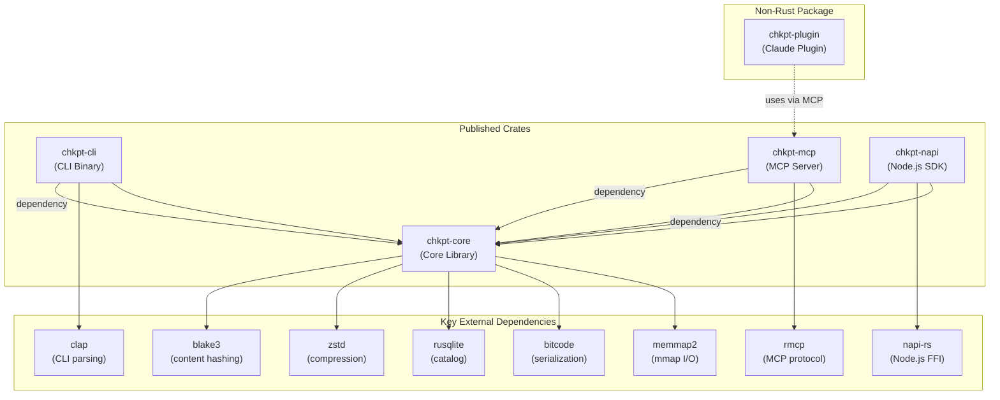
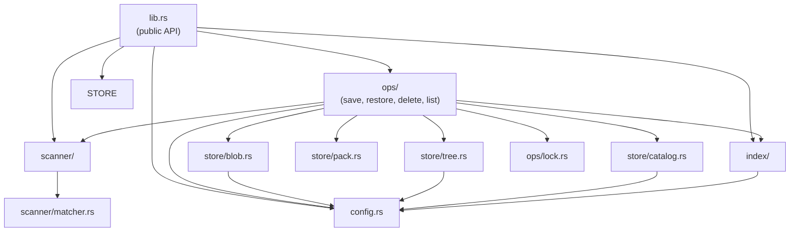
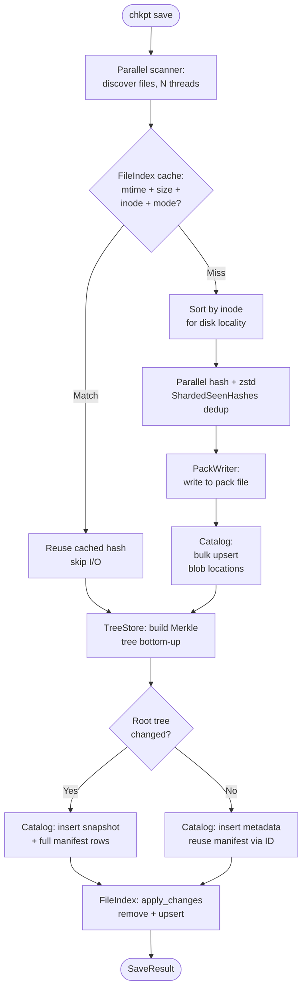
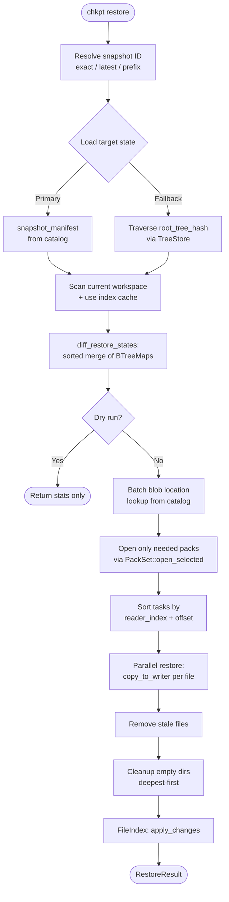
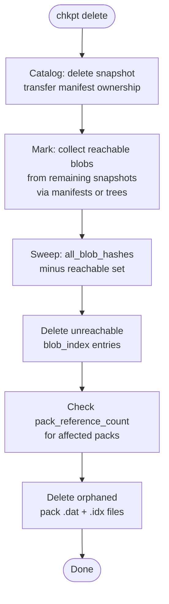

# chkpt Architecture Documentation

> **chkpt** — A fast, content-addressable checkpoint system for saving and restoring workspace snapshots without touching Git.

This document covers chkpt's architecture: monorepo structure, crate dependencies, module organization, design patterns, and data flows.

---

## Table of Contents

1. [System Overview](#system-overview)
2. [Monorepo Structure](#monorepo-structure)
3. [Crate Dependency Graph](#crate-dependency-graph)
4. [Core Library Architecture](#core-library-architecture)
5. [Scanner Module](#scanner-module)
6. [Store Modules](#store-modules)
7. [Index Module](#index-module)
8. [Operations Module](#operations-module)
9. [Configuration](#configuration)
10. [Error Handling](#error-handling)
11. [User Interface Layers](#user-interface-layers)
12. [Storage Layout](#storage-layout)
13. [Data Flow Diagrams](#data-flow-diagrams)
14. [Testing Infrastructure](#testing-infrastructure)

---

## System Overview

### High-Level Architecture

```
┌────────────────────────────────────────────────────────────────────────┐
│              chkpt — Content-Addressable Checkpoint System              │
└────────────────────────────────────────────────────────────────────────┘

User Input          Interface Layer       Core Library          Storage
──────────          ───────────────       ────────────          ───────

$ chkpt save    ─→  CLI              ─→  Scanner           ─→  ~/.chkpt/
$ chkpt restore     (clap)               (parallel walk)       stores/
                    MCP Server            BlobStore             <project>/
                    (rmcp, stdio)         (BLAKE3 + zstd)       ├─ catalog.sqlite
                    Node.js SDK           TreeStore             ├─ packs/
                    (NAPI bindings)       (bitcode)             ├─ trees/
                    Claude Plugin         MetadataCatalog       ├─ index.bin
                    (MCP + skill)         (SQLite)              └─ locks/
                                               ↓
                                          On failure:
                                          File-based locking
                                          prevents corruption
```

### Key Components

| Component | Crate | Responsibility |
|-----------|-------|----------------|
| **Core Library** | `chkpt-core` | Scanner, store, index, operations |
| **CLI** | `chkpt-cli` | Clap-based CLI with interactive restore selection |
| **MCP Server** | `chkpt-mcp` | Model Context Protocol server (stdio transport) |
| **Node.js SDK** | `chkpt-napi` | Native Node.js bindings via NAPI |
| **Claude Plugin** | `chkpt-plugin` | MCP tools + automation skill for Claude Code |

### Design Principles

1. **Content-Addressable Storage**: BLAKE3 hashing ensures identical content is stored once across all snapshots
2. **Git-Independent**: Snapshots live outside `.git/` — no commits, no branches, no merge conflicts
3. **Incremental by Default**: Binary index caches file metadata to skip re-hashing unchanged files
4. **Atomic Operations**: File-based locking prevents concurrent corruption; temp-file-then-rename for writes
5. **Catalog-Centric**: `catalog.sqlite` is the single metadata source of truth — snapshot metadata, manifests, and blob locations all live in SQLite
6. **Multi-Interface**: Core library is interface-agnostic — CLI, MCP, NAPI, and Plugin all share the same ops

---

## Monorepo Structure

```
chkpt/
├── crates/
│   ├── chkpt-core/                       Core library (all business logic)
│   │   ├── src/
│   │   │   ├── lib.rs                    Public API
│   │   │   ├── config.rs                 Store layout & project ID
│   │   │   ├── error.rs                  Error types (thiserror)
│   │   │   ├── scanner/                  File discovery & filtering
│   │   │   │   ├── mod.rs                Scanner entry point
│   │   │   │   ├── walker.rs             Parallel directory traversal
│   │   │   │   └── matcher.rs            Ignore pattern matching
│   │   │   ├── store/                    Content-addressed object store
│   │   │   │   ├── blob.rs               BLAKE3 hashing & content reading
│   │   │   │   ├── tree.rs               Directory structure (bitcode + pack)
│   │   │   │   ├── pack.rs               Packed blob IO & indexed lookup
│   │   │   │   ├── catalog.rs            SQLite metadata catalog
│   │   │   │   └── snapshot.rs           Public Snapshot & SnapshotStats types
│   │   │   ├── index/                    Binary file metadata cache
│   │   │   │   └── mod.rs                FileIndex (bitcode → index.bin)
│   │   │   └── ops/                      Checkpoint operations
│   │   │       ├── mod.rs                Operation exports
│   │   │       ├── save.rs               Save workspace → snapshot
│   │   │       ├── restore.rs            Restore snapshot → workspace
│   │   │       ├── delete.rs             Delete snapshot + GC
│   │   │       ├── list.rs               List snapshots
│   │   │       └── lock.rs               File-based mutual exclusion
│   │   ├── tests/                        Integration tests
│   │   │   ├── blob_test.rs
│   │   │   ├── tree_test.rs
│   │   │   ├── catalog_test.rs
│   │   │   ├── index_test.rs
│   │   │   ├── scanner_test.rs
│   │   │   ├── save_test.rs
│   │   │   ├── restore_test.rs
│   │   │   ├── delete_test.rs
│   │   │   ├── list_test.rs
│   │   │   ├── pack_test.rs
│   │   │   ├── lock_test.rs
│   │   │   ├── config_test.rs
│   │   │   └── e2e_test.rs
│   │   └── benches/
│   │       └── save_pipeline.rs          Save benchmark (custom harness)
│   │
│   ├── chkpt-cli/                        CLI binary
│   │   └── src/
│   │       └── main.rs                   Clap commands + interactive UI
│   │
│   ├── chkpt-mcp/                        MCP server
│   │   └── src/
│   │       └── main.rs                   stdio transport, 4 tools
│   │
│   ├── chkpt-napi/                       Node.js native bindings
│   │   ├── src/
│   │   │   ├── lib.rs                    Module registration
│   │   │   ├── ops.rs                    save/list/restore/delete
│   │   │   ├── scanner.rs                scan_workspace binding
│   │   │   ├── store.rs                  Blob hash & tree access
│   │   │   ├── index.rs                  File index access
│   │   │   ├── config.rs                 Store layout binding
│   │   │   └── error.rs                  Error mapping
│   │   └── __test__/                     Vitest tests
│   │
│   └── chkpt-plugin/                     Claude Code plugin (not a Rust crate)
│       ├── plugin.json                   Plugin metadata
│       ├── .mcp.json                     MCP server config
│       └── skills/chkpt/                 /chkpt skill + reference docs
│
├── Cargo.toml                            Workspace root
├── README.md
└── CONTRIBUTING.md
```

### Workspace Configuration

- **Build System**: Cargo workspaces (root `Cargo.toml`)
- **Members**: `crates/chkpt-core`, `crates/chkpt-cli`, `crates/chkpt-mcp`, `crates/chkpt-napi`
- **Note**: `chkpt-plugin` is a pure metadata/skill package — it has no `Cargo.toml` and is not a workspace member

---

## Crate Dependency Graph



### Dependency Direction

| From | To | Reason |
|------|----|--------|
| `chkpt-cli` → `chkpt-core` | CLI wraps core save/restore/delete/list |
| `chkpt-mcp` → `chkpt-core` | MCP server exposes core ops as tools |
| `chkpt-napi` → `chkpt-core` | NAPI bindings call core ops from Node.js |
| `chkpt-plugin` → `chkpt-mcp` | Plugin launches MCP server via `npx @chkpt/mcp` |

---

## Core Library Architecture

### Module Organization

```
crates/chkpt-core/src/
│
├── lib.rs                   Public API (re-exports 6 modules)
├── config.rs                StoreLayout + project_id_from_path()
├── error.rs                 ChkpttError enum (thiserror)
│
├── scanner/                 File Discovery
│   ├── mod.rs               scan_workspace() entry point
│   ├── walker.rs            Parallel directory traversal (ignore crate)
│   └── matcher.rs           IgnoreMatcher (built-in + .chkptignore)
│
├── store/                   Content-Addressed Storage
│   ├── blob.rs              BLAKE3 hashing + mmap for large files
│   ├── tree.rs              TreeStore (bitcode → loose files + CKTR packs)
│   ├── pack.rs              PackStore (CHKP packs + binary-search index)
│   ├── catalog.rs           MetadataCatalog (SQLite WAL)
│   └── snapshot.rs          Snapshot + SnapshotStats data types
│
├── index/                   Incremental Cache
│   └── mod.rs               FileIndex (bitcode → index.bin)
│
└── ops/                     Checkpoint Operations
    ├── mod.rs               Op exports
    ├── save.rs              Save (scan → hash → pack → catalog)
    ├── restore.rs           Restore (diff → apply → cleanup)
    ├── delete.rs            Delete + mark-and-sweep GC
    ├── list.rs              List snapshots (sorted, limited)
    └── lock.rs              ProjectLock (flock-based exclusion)
```

### Module Dependency Flow



---

## Scanner Module

The Scanner module recursively discovers files in a workspace while respecting ignore rules, using parallel traversal for performance.

### Key Types

```rust
pub struct ScannedFile {
    pub relative_path: String,      // Forward-slash separated ("src/main.rs")
    pub absolute_path: PathBuf,     // Full filesystem path
    pub size: u64,                  // File size in bytes
    pub mtime_secs: i64,           // Unix modification timestamp
    pub mtime_nanos: i64,          // Nanosecond precision
    pub device: Option<u64>,       // Unix device ID (None on non-Unix)
    pub inode: Option<u64>,        // Unix inode (None on non-Unix)
    pub mode: u32,                 // Unix file permissions
    pub is_symlink: bool,          // Whether the entry is a symlink
}
```

### Public API

| Function | Description |
|----------|-------------|
| `scan_workspace(root, chkptignore)` | Parallel walk with `include_deps=false` |
| `scan_workspace_with_options(root, chkptignore, include_deps)` | Full-control scan |
| `scan_workspace_parallel(root, chkptignore)` | Deprecated alias for `scan_workspace` |

All functions return results sorted by `relative_path` for deterministic ordering.

### Ignore Rules

```
IgnoreMatcher
├── Always Excluded (hardcoded, never overridable)
│   ├── .git/              Version control
│   ├── .chkpt/            Checkpoint store itself
│   └── target/            Rust build artifacts
│
├── Dependency Dirs (excluded by default, included when include_deps=true)
│   ├── node_modules/      JS dependencies
│   ├── .venv/             Python venv
│   ├── venv/              Python venv (alt)
│   ├── __pypackages__/    Python packages
│   ├── .tox/              Tox environments
│   ├── .nox/              Nox environments
│   ├── .gradle/           Gradle cache
│   └── .m2/               Maven cache
│
└── Custom Exclusions (.chkptignore file)
    └── Gitignore syntax via `ignore` crate's GitignoreBuilder
```

### Parallel Walking

The walker uses the `ignore` crate's `WalkBuilder::build_parallel()` with `std::thread::available_parallelism()` threads. Each thread collects files into a thread-local `Vec<ScannedFile>` which merges into a shared `Mutex<Vec>` on thread drop. Results are globally sorted after collection.

```
scan_workspace(workspace_root)
  1. Load .chkptignore (if exists; warn on parse error)
  2. Build parallel walker with N threads
     ├── Skip always-excluded directories entirely
     ├── Skip dependency directories unless include_deps=true
     ├── Check each file against .chkptignore patterns
     ├── Collect metadata (size, mtime, inode, device, mode, is_symlink)
     └── Thread-local batching → merge on thread drop
  3. Sort results by relative path (deterministic)
  4. Return Vec<ScannedFile>
```

---

## Store Modules

The Store layer implements a content-addressed object store with SQLite-backed metadata.

### BlobStore — Content Hashing & Reading

`store/blob.rs` provides free functions for BLAKE3 hashing and content access — there is no struct.

| Function | Description |
|----------|-------------|
| `hash_content_bytes(&[u8]) -> [u8; 32]` | BLAKE3 hash → raw bytes |
| `hash_content(&[u8]) -> String` | BLAKE3 hash → 64-char hex |
| `hash_file_bytes(&Path) -> Result<[u8; 32]>` | Hash file; mmap for ≥256 KiB, BufReader otherwise |
| `hash_path_bytes(&Path, is_symlink) -> Result<[u8; 32]>` | Hash file content or symlink target |
| `read_path_bytes(&Path, is_symlink) -> Result<Vec<u8>>` | Read file content or symlink target bytes |

```
┌──────────────────────────────────────────────────────────────────────┐
│                        Blob Hashing Pipeline                          │
└──────────────────────────────────────────────────────────────────────┘

Small file (<256 KiB):  BufReader (64 KiB chunks) ─→ BLAKE3 hash
Large file (≥256 KiB):  memmap2::Mmap              ─→ BLAKE3 hash

Symlink:  read_link target bytes ─→ BLAKE3 hash
```

### TreeStore — Directory Structure

Each directory is encoded as a sorted list of `TreeEntry` values, serialized with **bitcode**, and stored content-addressed by BLAKE3 hash.

```rust
pub enum EntryType { File, Dir, Symlink }

pub struct TreeEntry {
    pub name: String,       // Filename component only
    pub entry_type: EntryType,
    pub hash: [u8; 32],     // Blob hash (File/Symlink) or subtree hash (Dir)
    pub size: u64,
    pub mode: u32,
}
```

**Dual storage**: trees can exist as both loose files and packed objects.

**Loose tree storage** (`trees/{2-char prefix}/{62-char rest}`):
- Bitcode-serialized, zstd-compressed
- Atomic writes via `NamedTempFile::persist_noclobber`

**Tree pack format** (distinct from blob packs):

```
Tree Pack (.dat):
┌──────────┬─────────┬───────┬────────────────────────────────────────┐
│ CKTR     │ VERSION │ COUNT │ [hash(32B) | comp_size(8B) | data]*   │
│ (magic)  │ (u32)   │ (u32) │                                        │
└──────────┴─────────┴───────┴────────────────────────────────────────┘

Tree Index (.idx):
┌────────────────────────────────────────────────────────┐
│ [hash(32B) | offset(u64) | size(u64)]* (sorted by hash)│
└────────────────────────────────────────────────────────┘
→ Binary search for O(log n) lookup
```

Read priority: pack first, then loose files. The `TreeStore` opens `trees.dat`/`trees.idx` as mmaps at construction time.

**Tree construction (bottom-up):**

```
workspace/
├── src/
│   ├── main.rs          ─→ TreeEntry { name: "main.rs", type: File, hash: <blob> }
│   └── lib.rs           ─→ TreeEntry { name: "lib.rs",  type: File, hash: <blob> }
├── Cargo.toml           ─→ TreeEntry { name: "Cargo.toml", type: File, hash: <blob> }

Step 1: Build tree for src/ → hash(bitcode([main.rs, lib.rs])) = <tree_src>
Step 2: Build root tree    → hash(bitcode([Cargo.toml, src/])) = <root_tree>
                                                  ↑
                                    TreeEntry { name: "src", type: Dir, hash: <tree_src> }
```

### PackStore — Packed Blob Objects

Bundles multiple blobs into indexed pack files for efficient storage and sequential I/O during restore.

**Blob pack format:**

```
Pack Data (.dat):
┌──────────┬─────────┬───────┬────────────────────────────────────────┐
│ CHKP     │ VERSION │ COUNT │ [hash(32B) | comp_len(8B) | zstd]*    │
│ (magic)  │ (u32)   │ (u32) │                                        │
└──────────┴─────────┴───────┴────────────────────────────────────────┘
Header: 12 bytes (4 + 4 + 4)

Pack Index (.idx):
┌────────────────────────────────────────────────────────┐
│ [hash(32B) | offset(u64) | size(u64)]* (sorted by hash)│
└────────────────────────────────────────────────────────┘
→ 48 bytes per entry, binary search for O(log n) lookup
```

File naming: `pack-{16-char-hash}.dat` + `pack-{16-char-hash}.idx`, where the pack hash is derived from BLAKE3 of the pack contents.

**Key types:**

| Type | Responsibility |
|------|----------------|
| `PackWriter` | Streaming write: `add()` / `add_pre_compressed()` → `finish()` |
| `PackReader` | Mmap-backed random read from a single pack |
| `PackSet` | Multi-pack reader: `open_all()` / `open_selected()` |
| `PackLocation` | Internal pointer: `(reader_index, offset, size)` |

**PackWriter operations:**

| Method | Description |
|--------|-------------|
| `new(packs_dir)` | Create new pack writer |
| `add(content)` | Hash + zstd level 1 compress → append |
| `add_pre_compressed(hash, data)` | Append already-compressed data |
| `is_empty()` | Check if any entries were added |
| `finish()` | Write header, persist `.dat` + `.idx`, return pack hash |

**PackSet operations:**

| Method | Description |
|--------|-------------|
| `open_all(packs_dir)` | Open all packs in directory |
| `open_selected(packs_dir, hashes)` | Open only specified packs |
| `read(hash_hex)` | Decompress and return blob bytes |
| `try_read(hash_hex)` | Same as read, but returns `None` instead of error |
| `contains_bytes(hash)` | Check existence without decompression |
| `copy_to_writer(location, writer)` | Stream decompressed data to writer |

### MetadataCatalog — SQLite Metadata Store

`catalog.sqlite` is the single metadata source of truth, storing snapshot metadata, file manifests, and blob locations.

**Schema:**

```sql
CREATE TABLE IF NOT EXISTS snapshots (
    id TEXT PRIMARY KEY,               -- UUIDv7 (time-ordered)
    created_at TEXT NOT NULL,          -- RFC 3339 timestamp
    message TEXT,                      -- User annotation
    parent_snapshot_id TEXT,           -- Chain to previous snapshot
    manifest_snapshot_id TEXT,         -- Points to manifest owner (dedup)
    root_tree_hash BLOB,              -- 32-byte BLAKE3 hash of root tree
    total_files INTEGER NOT NULL,
    total_bytes INTEGER NOT NULL,
    new_objects INTEGER NOT NULL
);

CREATE TABLE IF NOT EXISTS snapshot_files (
    snapshot_id TEXT NOT NULL,          -- Owner of the manifest rows
    path TEXT NOT NULL,                -- Relative file path
    blob_hash BLOB NOT NULL,           -- 32-byte BLAKE3 hash
    size INTEGER NOT NULL,
    mode INTEGER NOT NULL,
    PRIMARY KEY (snapshot_id, path),
    FOREIGN KEY (snapshot_id) REFERENCES snapshots(id) ON DELETE CASCADE
);

CREATE INDEX IF NOT EXISTS idx_snapshot_files_snapshot_id
    ON snapshot_files (snapshot_id);

CREATE TABLE IF NOT EXISTS blob_index (
    blob_hash BLOB PRIMARY KEY,        -- 32-byte BLAKE3 hash
    pack_hash TEXT,                    -- 16-char pack ID (NULL if unassigned)
    size INTEGER NOT NULL
);
```

**Manifest deduplication**: When a save produces no changes, the new snapshot sets `manifest_snapshot_id` to point at the previous snapshot that owns the `snapshot_files` rows, avoiding row duplication. On delete, if the owner is removed, manifest rows are transferred to the newest remaining alias.

**Key types:**

```rust
pub struct CatalogSnapshot {
    pub id: String,
    pub created_at: DateTime<Utc>,
    pub message: Option<String>,
    pub parent_snapshot_id: Option<String>,
    pub manifest_snapshot_id: Option<String>,
    pub root_tree_hash: Option<[u8; 32]>,
    pub stats: SnapshotStats,
}

pub struct ManifestEntry {
    pub path: String,
    pub blob_hash: [u8; 32],
    pub size: u64,
    pub mode: u32,
}

pub struct BlobLocation {
    pub pack_hash: Option<String>,
    pub size: u64,
}
```

**MetadataCatalog operations:**

| Method | Description |
|--------|-------------|
| `open(path)` | Open or create catalog (WAL mode, runs migrations) |
| `insert_snapshot(snapshot, manifest)` | Full insert with manifest rows |
| `insert_snapshot_metadata_only(snapshot, manifest_id)` | Metadata-only, reuses manifest |
| `load_snapshot(id)` | Load single snapshot |
| `latest_snapshot()` | Most recent snapshot |
| `resolve_snapshot_ref(ref)` | Resolve `"latest"`, full ID, or unique prefix |
| `list_snapshots(limit)` | All snapshots, `created_at DESC` |
| `snapshot_manifest(id)` | Load manifest entries for snapshot |
| `delete_snapshot(id)` | Delete with manifest ownership transfer |
| `bulk_upsert_blob_locations(entries)` | Register blobs in packs |
| `blob_location(hash)` | Lookup single blob's pack location |
| `blob_locations_for_hashes(hashes)` | Batch lookup (chunked at 512 vars) |
| `all_blob_hashes()` | All registered blob hashes |
| `delete_blob_location(hash)` | Remove blob entry |
| `pack_reference_count(pack_hash)` | Count blobs referencing a pack |

### Snapshot Types — Public Data

```rust
pub struct Snapshot {
    pub id: String,                        // UUIDv7 (time-ordered)
    pub created_at: DateTime<Utc>,         // RFC 3339 timestamp
    pub message: Option<String>,           // User annotation
    pub root_tree_hash: [u8; 32],          // Root of Merkle tree
    pub parent_snapshot_id: Option<String>, // Chain to previous
    pub stats: SnapshotStats,
}

pub struct SnapshotStats {
    pub total_files: u64,
    pub total_bytes: u64,
    pub new_objects: u64,       // Objects not deduplicated
}
```

`Snapshot` is the public-facing type returned by `ops::list`. It differs from `CatalogSnapshot` (internal) in that `root_tree_hash` is non-optional (defaults to zeroes if absent).

---

## Index Module

Binary file metadata cache (`index.bin`) that makes saves incremental by skipping re-hashing of unchanged files.

### Storage Format

The index is a **bitcode-serialized** `Vec<FileEntry>`, loaded entirely into memory as a `HashMap<String, FileEntry>`. This is not SQLite — it is a flat binary file with atomic write-through.

```rust
pub struct FileEntry {
    pub path: String,           // Relative path (HashMap key)
    pub blob_hash: [u8; 32],   // BLAKE3 hash
    pub size: u64,              // File size
    pub mtime_secs: i64,       // Modification timestamp (seconds)
    pub mtime_nanos: i64,      // Nanosecond component
    pub inode: Option<u64>,    // Unix inode (change detection)
    pub mode: u32,             // Unix permissions
}
```

### Change Detection Logic

```
For each scanned file:
  1. Lookup cached entry by path
  2. Compare: mtime_secs + mtime_nanos + size + inode + mode
     ├── All match → use cached blob_hash (skip read + hash)
     └── Any differ → read file → BLAKE3 hash → store if new
```

This gives **O(1) per unchanged file** since there is no disk I/O for re-hashing.

### Operations

| Method | Description |
|--------|-------------|
| `open(path)` | Load from `index.bin`; empty if file absent |
| `upsert(entry)` | Insert or update single entry (write-through) |
| `bulk_upsert(entries)` | Batch insert/update |
| `bulk_remove(paths)` | Batch remove |
| `apply_changes(remove, upsert)` | Atomic combined update |
| `get(path)` | Lookup by relative path |
| `remove(path)` | Delete single entry |
| `all_paths()` | List all indexed paths |
| `all_entries()` | Full index contents |
| `entries()` | Direct `HashMap` reference |
| `clear()` | Wipe entire index |

**Flush mechanism**: writes to `index.bin.tmp` then renames over `index.bin` (atomic on Unix).

---

## Operations Module

Orchestrates high-level checkpoint workflows: save, restore, delete, list.

### Lock Module

Mutual exclusion using kernel-level file locking (`fs4` crate, `flock`-based).

```rust
pub struct ProjectLock {
    _file: File,    // Holds exclusive flock; auto-releases on drop
}
```

- Creates `locks/project.lock` file
- Non-blocking `try_lock_exclusive()`
- Returns `LockHeld` error if already locked
- No daemon required — lock auto-releases on process exit/crash (RAII)

### Save Operation

**Entry point:** `save(workspace_root, SaveOptions) -> Result<SaveResult>`

```rust
pub struct SaveOptions {
    pub message: Option<String>,
    pub include_deps: bool,
    pub progress: ProgressCallback,  // Option<Box<dyn Fn(ProgressEvent) + Send + Sync>>
}

pub struct SaveResult {
    pub snapshot_id: String,
    pub stats: SnapshotStats,
}
```

```
save(workspace_root, options)
  │
  1. Compute project ID = BLAKE3(canonical_path)[0..16] (hex)
  2. Create store layout: ~/.chkpt/stores/<project-id>/
  3. Acquire project lock (flock on locks/project.lock)
  │
  4. Open MetadataCatalog (catalog.sqlite, WAL mode)
  5. Parallel scan workspace → Vec<ScannedFile>
  │  └── Emit ScanComplete progress event
  │
  6. Open FileIndex (index.bin, bitcode)
  7. Open PackSet (all existing packs, mmap)
  8. Create PackWriter
  │
  9. For each scanned file:
  │  ├── Check index cache (mtime + size + inode + mode)
  │  │   ├── Match → reuse cached hash (no I/O)
  │  │   └── Differ → queue for prepare
  │  └── Track unchanged files
  │
  10. Sort queued files by inode for disk locality
  │
  11. Parallel hash + zstd compress:
  │  ├── Multi-threaded via std::thread::scope
  │  ├── ShardedSeenHashes (64 shards) for lock-free dedup
  │  ├── Hardlink detection via (device, inode) key
  │  ├── Per-thread zstd::bulk::Compressor (level 1)
  │  └── Emit ProcessFile progress events
  │
  12. Write new blobs to PackWriter → finish() → persist pack
  13. Bulk upsert blob locations to catalog
  │  └── Emit PackComplete progress event
  │
  14. Build Merkle tree (bottom-up):
  │  ├── Sort files by path → BTreeMap<dir_prefix, entries>
  │  ├── TreeStore::write() per directory
  │  └── Dedup: reuse previous root_tree_hash if nothing changed
  │
  15. Determine parent snapshot from catalog.latest_snapshot()
  │
  16. Insert snapshot into catalog:
  │  ├── If manifest changed → insert_snapshot() (full manifest rows)
  │  └── If unchanged → insert_snapshot_metadata_only() (reuse manifest)
  │
  17. Update index: index.apply_changes(removed, updated)
  │
  └── Return SaveResult { snapshot_id, stats }
```

### Restore Operation

**Entry point:** `restore(workspace_root, snapshot_id, RestoreOptions) -> Result<RestoreResult>`

```rust
pub struct RestoreOptions {
    pub dry_run: bool,
    pub progress: ProgressCallback,
}

pub struct RestoreResult {
    pub snapshot_id: String,
    pub files_added: u64,
    pub files_changed: u64,
    pub files_removed: u64,
    pub files_unchanged: u64,
}
```

```
restore(workspace_root, snapshot_id, options)
  │
  1. Acquire project lock
  │
  2. Resolve snapshot ID:
  │  ├── "latest" → fetch most recent
  │  ├── Exact match → load directly
  │  ├── Prefix match → find unique match
  │  └── Error if ambiguous or not found
  │
  3. Load target state:
  │  ├── Primary: snapshot_manifest() → Vec<ManifestEntry>
  │  └── Fallback: traverse root_tree_hash via TreeStore
  │      (for snapshots predating manifest storage)
  │
  4. Detect dependency dirs in target paths → set include_deps
  │
  5. Scan current workspace:
  │  ├── Use FileIndex cache to skip rehashing unchanged files
  │  └── Build Map<path, current_hash>
  │  └── Emit ScanCurrentComplete
  │
  6. diff_restore_states() — sorted merge of two BTreeMaps:
  │  ├── files_to_add    = target - current
  │  ├── files_to_change = both, but hash differs
  │  ├── files_to_remove = current - target
  │  └── files_unchanged = both, same hash
  │
  7. If dry_run → return stats without modifying
  │
  8. Resolve blob sources:
  │  ├── Batch blob_locations_for_hashes() from catalog
  │  └── Open only needed packs via PackSet::open_selected()
  │
  9. Build restore tasks sorted by (reader_index, offset)
  │  └── Sequential I/O optimization within each pack
  │
  10. Emit RestoreStart { add, change, remove }
  │
  11. Parallel restore (std::thread::scope):
  │  ├── Files: pack_set.copy_to_writer(location, BufWriter)
  │  ├── Symlinks: read bytes → std::os::unix::fs::symlink
  │  ├── Create parent directories as needed
  │  └── Emit RestoreFile per file
  │
  12. Remove files not in target
  │
  13. Cleanup empty parent directories (deepest-first)
  │
  14. Update index: index.apply_changes(removed, restored_entries)
  │
  └── Return RestoreResult
```

### Delete Operation + Garbage Collection

**Entry point:** `delete(workspace_root, snapshot_id) -> Result<()>`

```
delete(workspace_root, snapshot_id)
  │
  1. Acquire project lock
  2. Verify snapshot exists via catalog.load_snapshot()
  │
  3. Delete snapshot from catalog:
  │  └── If this snapshot owns manifest rows and aliases exist,
  │      transfer ownership to the newest alias
  │
  4. Collect reachable blobs from remaining snapshots:
  │  ├── For each remaining snapshot:
  │  │   ├── Try manifest (snapshot_files rows)
  │  │   └── Fallback to tree traversal (root_tree_hash)
  │  └── Build HashSet<[u8; 32]> of live blobs
  │
  5. Garbage collect unreachable blobs:
  │  ├── catalog.all_blob_hashes() → all known blobs
  │  ├── Delete blob_index entries not in reachable set
  │  └── Collect affected pack hashes
  │
  6. Remove orphaned packs:
  │  └── For each touched pack:
  │      if pack_reference_count() == 0 →
  │          delete pack-{hash}.dat + pack-{hash}.idx
  │
  └── Lock drops (conservative: if tree read fails, skip orphan cleanup)
```

### List Operation

**Entry point:** `list(workspace_root, limit) -> Result<Vec<Snapshot>>`

Opens catalog (no lock needed), calls `catalog.list_snapshots(limit)` (ordered `created_at DESC, id DESC`), maps `CatalogSnapshot` → `Snapshot`.

---

## Configuration

### StoreLayout

Manages the directory structure for a project's checkpoint store.

```rust
pub struct StoreLayout {
    base: PathBuf,  // ~/.chkpt/stores/<project-id>/
}
```

**Constructors:**

| Method | Description |
|--------|-------------|
| `new(project_id)` | Uses `CHKPT_HOME` env var → `dirs::home_dir()` → `.` |
| `from_home_dir(home, project_id)` | Explicit home directory |

**Path accessors:**

| Method | Path | Status |
|--------|------|--------|
| `base_dir()` | `{base}/` | Active |
| `catalog_path()` | `{base}/catalog.sqlite` | Active |
| `trees_dir()` | `{base}/trees/` | Active |
| `packs_dir()` | `{base}/packs/` | Active |
| `index_path()` | `{base}/index.bin` | Active |
| `locks_dir()` | `{base}/locks/` | Active |
| `tree_path(hash)` | `{base}/trees/{2-char}/{62-char}` | Active |
| `snapshots_dir()` | `{base}/snapshots/` | Legacy (unused by live path) |
| `attachments_deps_dir()` | `{base}/attachments/deps/` | Legacy (unused by live path) |
| `attachments_git_dir()` | `{base}/attachments/git/` | Legacy (unused by live path) |

`ensure_dirs()` creates all directories. On macOS, also creates `.metadata_never_index` in the base directory to suppress Spotlight indexing.

### Project ID

`project_id_from_path(path: &Path) -> String` computes a 16-hex-char project ID by BLAKE3-hashing the canonical workspace path.

---

## Error Handling

```rust
pub enum ChkpttError {
    Io(std::io::Error),
    Sqlite(rusqlite::Error),
    Bitcode(String),
    SnapshotNotFound(String),
    LockHeld,
    StoreCorrupted(String),
    ObjectNotFound(String),
    RestoreFailed(String),
    Other(String),
}
```

Uses `thiserror` for automatic `Display` + `Error` implementations. Errors propagate from store → ops → interface layers with context.

---

## User Interface Layers

### CLI (`chkpt-cli`)

```
$ chkpt save [-m MESSAGE] [--include-deps]    Save workspace snapshot
$ chkpt list [-n LIMIT] [--full]              List snapshots (newest first)
$ chkpt restore [ID] [--dry-run]              Restore to snapshot
$ chkpt delete ID                             Delete snapshot + GC
```

| Feature | Implementation |
|---------|----------------|
| Argument parsing | `clap` (derive macro) |
| Interactive restore | `dialoguer::Select` (if ID omitted, shows picker with ID/timestamp/files/message) |
| Progress display | Spinner on scan → progress bar on file processing/restore → suppressed when stderr is not a TTY |
| Output formatting | Pretty-printed tables with timestamps |
| ID display | 8-char prefix by default; `--full` shows full 38-char UUIDv7 |
| Error handling | `anyhow` for context-rich errors |

### MCP Server (`chkpt-mcp`)

Exposes 4 tools over stdio transport. Server name: `"chkpt"`, title: `"chkpt - Workspace Checkpoint Manager"`.

| Tool | Parameters | Returns |
|------|-----------|---------|
| `checkpoint_save` | `workspace_path`, `message?`, `include_deps?` | `{ snapshot_id, stats }` |
| `checkpoint_list` | `workspace_path`, `limit?` | `[{ id, created_at, message, stats }]` |
| `checkpoint_restore` | `workspace_path`, `snapshot_id`, `dry_run?` | `{ snapshot_id, files_added/changed/removed/unchanged }` |
| `checkpoint_delete` | `workspace_path`, `snapshot_id` | `{ deleted, snapshot_id, message }` |

Built with `rmcp` crate (0.17, server + macros + transport-io) and `schemars` for JSON schema generation.

### Node.js SDK (`chkpt-napi`)

Native Node.js bindings via NAPI. All I/O operations are async.

```
chkpt-napi/src/
├── lib.rs              Module registration
├── ops.rs              save(), list(), restore(), delete_snapshot()
├── scanner.rs          scanWorkspace()
├── store.rs            blob_hash(), tree_build(), tree_load()
├── index.rs            index_open/lookup/upsert/all_entries/clear
├── config.rs           get_project_id(), get_store_layout()
└── error.rs            ChkpttError → napi::Error mapping
```

Returns native JS objects (`JsSaveResult`, `JsRestoreResult`, `JsScannedFile`, etc.) via JSON serialization.

### Claude Code Plugin (`chkpt-plugin`)

Provides:
- 4 MCP tools (same interface as MCP server, launched via `npx @chkpt/mcp`)
- `/chkpt` automation skill with three modes:
  1. **Proactive automation**: detects risky operations and suggests checkpoints
  2. **Direct operations**: handles explicit save/list/restore/delete requests (restore always requires dry-run preview + confirmation)
  3. **Store inspection**: guides examination of catalog.sqlite and store files

---

## Storage Layout

For a project at `/home/user/myproject`:

```
~/.chkpt/stores/a1b2c3d4e5f6g7h8/       ← BLAKE3(canonical_path)[0..16]
├── catalog.sqlite                         Metadata source of truth (WAL mode)
├── catalog.sqlite-wal                     WAL journal
├── index.bin                              File metadata cache (bitcode)
├── locks/
│   └── project.lock                       Mutual exclusion (flock)
├── packs/                                Packed blob objects
│   ├── pack-a1b2c3d4e5f6g7h8.dat         Blob data (CHKP magic)
│   └── pack-a1b2c3d4e5f6g7h8.idx         Binary-searchable index
├── trees/                                Directory structures
│   ├── trees.dat                          Tree pack (CKTR magic)
│   ├── trees.idx                          Tree pack index
│   ├── a1/                               Loose trees (2-char prefix sharding)
│   │   └── 2b3c4d5e6f...
│   └── b2/
│       └── ...
├── snapshots/                            (Legacy, unused by live path)
└── attachments/                          (Legacy, unused by live path)
    ├── deps/
    └── git/
```

---

## Data Flow Diagrams

### Save Flow



### Restore Flow



### Delete + GC Flow



---

## Testing Infrastructure

### Test Coverage

| Test File | Module | What It Tests |
|-----------|--------|---------------|
| `blob_test.rs` | BlobStore | BLAKE3 hashing, mmap threshold, symlink hashing |
| `tree_test.rs` | TreeStore | Bitcode serialization, hierarchy, hash determinism, pack read/write |
| `catalog_test.rs` | MetadataCatalog | Insert/load/delete, manifest dedup, blob locations, prefix resolution |
| `index_test.rs` | FileIndex | Cache behavior, upsert, lookup, atomic write |
| `scanner_test.rs` | Scanner | .chkptignore patterns, dependency exclusion, parallel walk |
| `save_test.rs` | Save op | Full save flow, stats, incremental, manifest reuse |
| `restore_test.rs` | Restore op | Restore, dry-run, file state verification |
| `delete_test.rs` | Delete op | Delete + mark-and-sweep GC, pack cleanup |
| `list_test.rs` | List op | Sorting, limits |
| `pack_test.rs` | PackStore | Pack format, binary search, read/write, multi-pack |
| `lock_test.rs` | Lock | Concurrent access, mutual exclusion |
| `config_test.rs` | Config | Store layout paths, project ID derivation |
| `e2e_test.rs` | End-to-end | Full save → restore → delete cycle |

### Benchmarks

`benches/save_pipeline.rs` — save benchmark with custom harness (`harness = false` in Cargo.toml).

### Node.js SDK Tests

Located at `crates/chkpt-napi/__test__/`, using Vitest for testing NAPI bindings.

### Key Dependencies

| Crate | Purpose |
|-------|---------|
| `blake3` | Content hashing (64-char hex, fast, SIMD-accelerated) |
| `zstd` | Compression (level 1 for packs) |
| `rusqlite` | SQLite with WAL journaling (bundled) |
| `bitcode` | Binary serialization for index and trees |
| `memmap2` | Memory-mapped I/O for large file hashing and pack reading |
| `tokio` | Async runtime (full features) |
| `uuid` | UUIDv7 for time-ordered snapshot IDs |
| `fs4` | File locking (flock, cross-platform) |
| `tempfile` | Atomic writes via NamedTempFile |
| `ignore` | Gitignore-style pattern matching + parallel walking |
| `thiserror` | Typed error definitions |
| `anyhow` | Context-rich error handling (CLI) |
| `clap` | CLI argument parsing (derive) |
| `dialoguer` | Interactive prompts (CLI) |
| `rmcp` | Model Context Protocol (MCP server) |
| `schemars` | JSON schema generation (MCP) |
| `napi` / `napi-derive` | Node.js native bindings |
| `tracing` | Structured logging |
| `chrono` | DateTime with timezone support |
| `dirs` | Home directory resolution |
